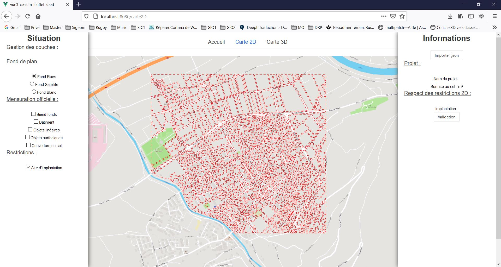
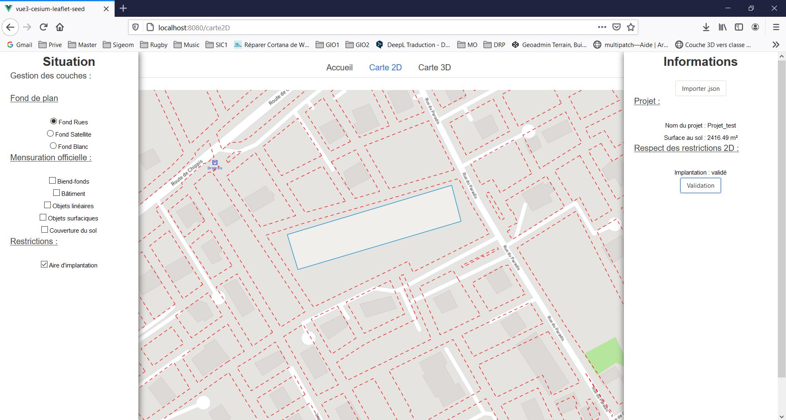
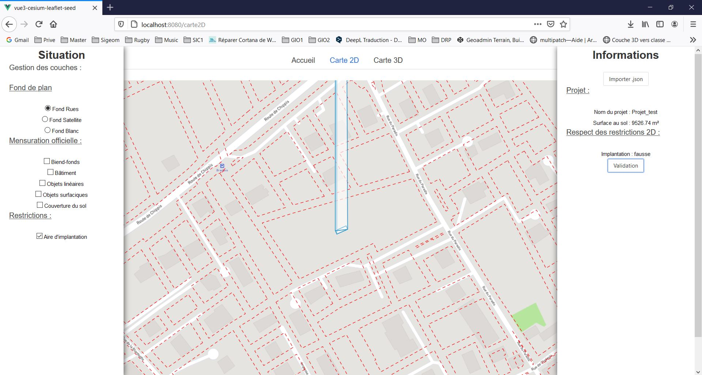

# Rapport projet de développement
## Développement d'une petite application web géoportail
***MDT - SA2020 - Bosson, Chevrier et Bobillier***

### Concept
Pour ce projet, il nous a été demander de développer une petite application web de type "géoportail".
Ci-dessous, quelques points spécifiques qui nous ont été demandé :
- Le développement doit se faire avec vue.js
- Intégrer une librairie avec des composants
- Menu d'accueil permettant d'afficher des couches spécifiques selon les désirent de l'utilisateur
- Pages affichants des données géographiques en 2D et 3D (OpenLayers et Cesium)
- Une page statique décrivent le projet, les outils et l'équipe
- Le projet doit être contrôlé et stocké sur Github

Pour respecter ces contraintes, nous avons choisi de développé un site web 2D et 3D intéractive ayant une utilitée pour notre métier. Un outil de validation de nouvelles constructions selon les contraintes liées à l'aménagement du territoire et de la mensuration officielle (MO). L'utilisateur pourra introduire son projet (par ex. bâtiment) dans le site web, visualiser son emplacement en 2D et 3D, soit son intégration dans l'environnement construit. Il pourra ensuite contrôler si la construction respecte les contraintes d'aménagement du territoire en appuyant sur un bouton de validation. Le site web retournera ensuite différentes informations. Par exemple :
- Nom du projet
- Surface de la construction
- Validation que la construction se situe à l'intérieur d'une aire d'implantation --> validé ou fausse
- ...
 

### Démarche

Nous avons commencé par créer un Github et à le partager entre les étudiants. Nous avons ensuite établit la structure du projet en se basant sur celle mise à disposition par les encadrants. 
Au départ, pour les tâches de préparation, nous avions décidé de se séparer les tâches entre nous :
- Recherche et préparation des données --> Méric
- Tests des données en entré --> Adrien
- Préparation de la structure html et css --> Quentin
 Nous avons vite remarqué que cette répartition n'était pas optimale, surtout à distance. Nous avons donc revu notre idée et avons décidé de s'entraider sur toutes les tâches. De plus cela permettra que chacun apprenne et comprenne mieux les objectifs du projet. De ce fait chacun à participé à mettre en place des outils .js, vue.js, sur des données OpenLayers et Cesium ainsi que sur les caluls avec turf.js.
L'outil Teams de Microsoft à aussi été utilisé à chaque fois que nous avons travaillé sur le projet. Il nous a permis de discuter sur nos intérogations et/ou problèmes ainsi que de voir en live de quoi nous parlions. Cette méthodologie nous a permis de compléter nos compétances et connaissances sur les thèmes abordés.
Le code a été commenté dans le but de faciliter sa compréhension.

### Données
L'acquisition des données est une étape très importante qui nous a pris beaucoup de temps. Nous avons pu avoir les données de la mensuration officiel via un bureau privé d'un étudiant. Pour les données du modèle numérique de terrain et des swissBuildings2.0, nous avons pu les avoir via l'HEIG-VD.
Pour pouvoir les utiliser, nous avons du effectuer de nombreux traitement dessus :
- Transformation de coordonnées, MN95 --> WGS84 et NF02 --> hauteur ellipsoidale
- Constructions des aires d'implantation
- Transformation des fichiers au format .geojson qui nous permet d'utiliser les données aussi bien avec OpenLayers qu'avec Cesium
- ...
 Les données téléchargées dans notre projet sont donc tous en WGS84 avec une hauteur ellipsoidale au format .geojson.
L'utilisateur qui voudra charger son projet devra donc tenir compte du système de coordonnée ainsi que du format. Dans le cas contraire, l'ajout du projet échouera.

### Problèmes
Tout au long du projet, nous avons été confronté à de nombreux problèmes que nous avons, dans la majoritée des cas, résolus. Ci-dessous, voici les principaux problèmes rencontrés :
1. Se remettre aux languages de programmation js, html et css que nous utlisons que dans des rares occasions, si ce n'est jamais dans le cadre de notre travail.
2. L'apprentissage de vue.js a été compliqué et pas évidente. Nous avons remarqué que nos connaissances sur vue.js se sont améliorées. Nous l'utilisons actuellement à un niveau basique.
3. Idem pour l'utilisation de cesium.
4. Quelques problèmes ont été rencontré au niveau des données de bases. Effectivement les transformations de coordonnées de MN95 --> WGS84, NF02 --> hauteur ellipsoidale et du format .dxf au .geojson n'a pas été facile. Pour régler ces soucis, nous avons du utiliser les programmes suivants : 
    - GeoSuite (transformation par lots, Reframe)
    - FME   
    - 3DReshaper
    - QGis
     Les données concernants les swissBuildings2.0, n'ont pas été utilisé car leurs transformations en .geojson n'a pas abouti. Effectivement ces dernières données sont un sorte de hachures et non des maillages. De se fait, lors des transformations, les informations concernants les altitudes ne suivaient pas. Dans le cadre de se projet, cela n'est pas très grave car nous pouvons utiliser les bâtiments en 3D depuis la source de donnée OSM. Les swissBuildings2.0 auraient amené une meilleure précision ainsi que des détails plus fin. Il serait intéressant de prendre contact avec swisstopo pour qu'il nous fournisse directement les données dans le format voulu. Ci-après, un lien intéressant qui pourrait aussi nous aider : [exemple avec swissBuildings2.0](https://codepen.io/geoadmin/pen/zBEYGE?editors=0011)
    
5. L'utilisation de Github nous à aussi posé des soucis. Effectivement nous avons tenté de l'utiliser via ligne de commande mais malheureusement se fut un echec.  Heureusement, nous avons trouver une alternative en utilisant le Github Desktop. L'utilisation est identique mais avec un interface graphique. L'utilisation de Github nous a bien rendu service pour travail en même temps et pour y récupèrer de temps à autres des données.
6. Un de nos principales problèmes était de pouvoir utiliser un seul projet que l'utilisateur importerait dans notre interface web. Le format .geojson a été choisi car il est supporté autant par OpenLayers que par cesium. Ce format "text" nous permet facilement d'attaquer la donnée qui se trouve à l'intérieur. Pour ce faire nous avons du créer un parseur qui récupère le texte du geojson. Dans le fichier json_data.js, nous créons une constante vide. Ensuite dans le fichier ViewOpenlayers.vue, nous attribuons avec la commande "getJSONcontent" une valeur à la constante sharejson. Avec cette astuce, il est maintenant possible de récupèrer cette constante depuis le fichier ViewCesium.vue et de charger la data dans cesium.
7. Concernant l'import des données de projet (fichier .geojson) et l'ouverture de la fenêtre qui permet d'aller chercher le bon fichier sur le pc de l'utilisateur, nous avons eu un problème concernant le nombre de clic à effectuer ainsi que l'ordre des clics sur les boutons. Effectivement nous devions cliquer d'abord sur le bouton pour parcourir les fichiers (aucun fenêtre ne s'ouvrait), puis cliquer sur le bouton d'import du projet, puis de nouveau sur le bouton qui ouvrait la fenêtre pour parcourir les fichiers. Pour remédier à ceci, nous avons fait une fonction asynchrone. Lorsque nous cliquons sur le bouton pour importer un json, en arrière plan, un clic est effectué sur le bouton caché qui sert à ouvrir la fenêtre pour aller rechercher le bon fichier de l'utilisateur. Le bouton caché est réalisé en utilisant la balise "hidden= "true"" sur l'id "file-input". Le clic est reprit avec l'id "file-input" dans le fichier import_projet.js.
8. Structure des données pour utilisation avec turf.js
9. Avec cesium (ViewCesum.vue) nous n'avons pas réussi à fair fonctionner des paramètres particuliers avec par exemple la fonction "Cesium.GeoJsonDataSource.load". Effectivement selon la documentation et les exemples vu, il devrait être possible de gérer si une couche importée soit visible ou non avec la propriété "show = true or false (booléean))"  Malheureusement, par manque de temps, nous n'avons pas pu aller plus loin dans nos recherches conernant les calculs de volumes et d'intersection 3D.

### Conclusion
Nous pensons que ce projet nous a apporter beaucoup de nouvelles connaissances, principalement dans la programmation et la gestion de projet avec Github. Nous avons pu constater que pour apprendre les points précités, il est essentielle d'utiliser ces outils régulièrement voir quotidiennement. Dans un bureau de géomètres faisant du code règulièrement, il est nécessaire d'avoir un spécialiste (par exemple un ingénieur géomaticien spécialite dans la géoinformation) pour que les travaux soient rentables.  Ce projet nous a également permis mieux de comprendre les enjeux et les opportunitées qui sont lié à ce type de projet. Notre corps de métier pourrait tout à fait proposer se genre de service (visualisation web 2D et 3D) avec les données que nous posédons. Cela nécessite tout de même quelques investissements. Cela se payera à l'avenir si les bureaux ne manquent pas la coche.  Nous pensons que grâce à se projet, nous avons une bonne partie des outils pour superviser un travail ou un développement de ce genre au sein de nos bureaus respectifs.

### Perspective

1. Géneral
    - Programmer une fonction qui transforme directement les coordonnées MN95 et l'altitude NF02 en WGS84 avec l'hauteur ellipsoidale
    - Produire un rapport sur la validation au format .pdf que l'utilisateur peut imprimer
    - Améliorer le styles .css
    - ...
2. Cesium
    - Faire fonctionner les propriétés de visibilitée des couches
    - Programmer les calculs d'intersection entre le projet et les restrictions 3D
    - Calculer le volume d'implantation 3D
    - Gérer les styles des couches
    - Fonctionnalitée qui zoom directement sur le projet au moment de l'import
    - ...
3. Openlayers
    - Calculer l'emprise de l'objet 3D pour calculer une surface au sol (avec un projet en 3D, en 2D ok)
    - Barre de recherche pour zoomer plus facilement sur le projet
    - Fonctionnalitée qui zoom directement sur le projet au moment de l'import
    - ...

### Documentation
Notre site web contient 3 pages différentes. La page d'accueil, la page qui concerne la 2D et celle qui contient la 3D. Pour naviguer entre ces dernières, il vous suffit de cliquer sur le nom (onglet) voulu en haut de chaque page.

#### Accueil
xxxxxxxxxxxxxxxxxx

#### 2D
La page 2D est séparé en 3 partie.
  
 La première à gauche qui est un menu de changement et d'affichage de couche. La deuxième au centre concerne la visualisation des données en 2D et la troisième, à droite, gèrent les aspects liés à l'import du projet, aux calculs ainsi qu'à la validation des restrictions.

##### Menu de gauche
Le menu de gauches est séparé en 3 chapitres :
1. Fond de plan, qui permet de choisir le fond désiré par l'utilisateur. De base le fond "rues" est affiché.
    - Rues
    - Satellite qui correspond à une orthophoto
      
    - Blanc qui correspond à un fond blanc. Il peut être intéressant lors d'affichage des couches de la MO et du projet
2. Mensuration officielle qui permet d'afficher plusieurs couches de la MO avec un style qui respect les normes.
    - Biend-fonds    
    - Bâtiments     
    - Objets linéaires
    - Objets surfaciques
    - Couverture du sol
   Ci-dessous un exemple avec le fond blanc et la MO.   

3. Restrictions qui contient les restrictions concernat l'implantation des bâtiments.
    - Aire d'implantation   
   Ci-dessous un exemple avec le fond blanc, la MO et les restictions.   

##### Partie du centre
La partie du centre est une interface 2D de naviguation. Pour se déplacer et zoomer dans la fenêtre, l'utilisateur doit utiliser les outils standards de la souris.

##### Menu de droite
Le menu de droite est séparé en 3 parties :
1. Un bouton d'import de projet, qui en cliquant dessus, ouvre une fenêtre qui permet d'aller chercher notre fichier de projet. Le fichier doit être au format .geojson, en WGS84 et avec une hauteur ellipsoidale.       Le projet est bien importé.    
2. Cette partie concerne les informations du projet. Lors du calcul de validation (voir prochain point --> 3), ces champs seront remplis avec le nom du projet et la surface qui est calculé en live.
3. La troisième partie est la validation des restricitons selon le projet importé. Lorsque l'utilisateur clic sur le bouton "Validation", un calcul en live est exécuté. Les champs du nom du projet, du calcul de surface et l'information sur la validation du projet sont mis à jour. Le champs est rempli avec "validé" si le projet respect les restrictions et "fausse" si le projet ne respect pas les restrictions.   Ci-dessous, le projet est conforme aux restrictions. La vérification retourne "validé".      Ci-dessous, le projet n'est pas conforme aux restrictions. La vérification retourne "fausse".    

#### 3D
***Remarques : Cette partie avec cesium n'est pas terminée. Effectivement, les boutons et calculs ne fonctionnement pas encore tous*** La partie en 3D est séparé sur le même principe que la partie 2D, en 3 parties. A gauche et à droite l'utilisateur trouve des menus et au centre l'interface 3D  
##### Menu de gauche
Ce menu nous permet de gèrer l'affiche des couches 3D. Ici l'utilisateur à le choix d'afficher le modèle numérique de terrain (MNT) et les volumes d'implantation. Actuellement, la couche des volumes d'implantation est affiché de base. ***Actuellement codé en dur et affichage seulement des volumes d'implantation car le MNT n'amène pas grand chose au niveau de la visualisation***
##### Partie du centre
Cette partie concerne l'affichage des données 3D ainsi que du projet. L'utilisation du naviguateur cesium est identique à son utilisation standard.
##### Menu de droite
Ce menu concerne l'import du projet en 3D ainsi que la validation en 3D par rapport au volume d'implantation.
1. Pour importer le projet 3D, il suffit juste à l'utilisateur de cliquer sur le bouton "Afficher le projet en 3D".   ***Attention, il est nécessaire d'avoir importé au préalable le projet depuis la page 2D, bouton d'import du projet***   
2. Partie qui concerne les informations du projet comme le nom, le volume ainsi que la validation du projet par rapport aux restrictions. Ces informations sont mises à jour lorsque le bouton de validation est pressé (voir point suivant 3). ***Actuellement ne fonctionne pas encore***
3. Bouton qui permet à l'utilisateur de contôler si son projet 3D respecte les restrictions 3D. Lorsque l'utilisateur clic sur le bouton "Validation 3D", un calcul en live est exécuté. Les champs du nom du projet, du calcul de volume et l'information sur la validation du projet sont mis à jour. Le champs est rempli avec "validé" si le projet respect les restrictions et "fausse" si le projet ne respect pas les restrictions. ***Actuellement ne fonctionne pas encore***
  L'utilisateur peut désormait visualiser en 3D son projet. Actuellement la validation 3D peut se faire visuellement.  
  Copyright - Développé par A.Bosson, M.Chevrier et Q.Bobillier @SP2020MDT
